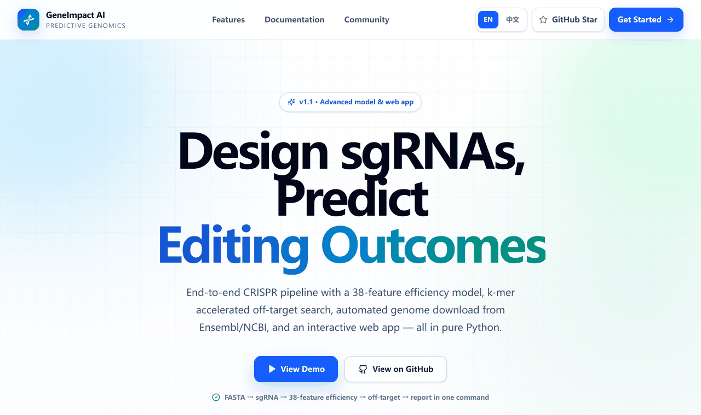
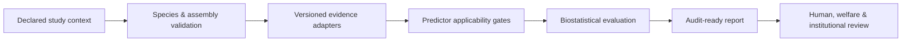

<div align="center">

# 🧬 GeneImpact AI

[](https://github.com/kfat77/geneimpact-ai/actions/workflows/test.yml)
[](LICENSE)
[](https://github.com/kfat77/geneimpact-ai)
[](pyproject.toml)
[](https://github.com/kfat77/geneimpact-ai/pulls)

**Evidence-aware genome-editing analysis that turns declared study context, predictor outputs, and biological evidence into reproducible, uncertainty-bounded audit reports.**

</div>

## 🌟 Live Interactive Demo

> ### Explore GeneImpact AI before installing anything
>
> The light-theme, bilingual demo runs a synthetic analysis entirely in your browser, with real-time biostatistical feedback, species validation, multi-omics context checks, and an audit-style result view.

[](https://kfat77.github.io/geneimpact-ai/)

🚀 **[Try the Live Demo Here](https://kfat77.github.io/geneimpact-ai/)**

> [!IMPORTANT]
> The Web Demo uses synthetic data and illustrative outputs. It is a product preview—not experimental evidence, an edit-design service, or a safety determination.

## Key Features

- 🧬 **Evidence-aware multi-omics integration** — Combine versioned reference assemblies, functional annotations, phenotype evidence, target-gene context, and independently produced predictor outputs without erasing source provenance.
- 🔬 **End-to-end prediction pipeline** — Design sgRNAs from genomic sequences, predict on-target editing efficiency, detect off-target sites, and generate auditable assessment reports in one command.
- 🎯 **Multi-nuclease sgRNA design** — Support for SpCas9 (NGG), SaCas9 (NNGRRT), and Cas12a (TTTV) with automatic PAM scanning on both strands.
- 📊 **Off-target detection** — Seed-region-weighted mismatch scoring with risk classification (high/moderate/low) and specificity metrics. K-mer seed-and-extend algorithm for 10× faster search on large genomes.
- 📈 **Efficiency prediction** — 38-feature RuleSet2-Enhanced model (PWM + thermodynamics + dinucleotide + composition) with species-specific logistic calibration for mouse, rat, zebrafish, macaque, and fruit fly. Confidence: 0.55–0.85.
- 🧪 **Indel outcome prediction** — Predicted insertion/deletion distribution and most likely outcome size.
- 🌐 **Interactive web app** — Flask REST API with dark-theme SPA frontend for sgRNA design, efficiency prediction, off-target analysis, and genome download.
- ⬇️ **Genome auto-download** — Fetch reference sequences from Ensembl REST API (NCBI fallback) with SHA-256 local caching — no manual FASTA download needed.
- 📋 **Automated evidence scoring** — Prediction outputs automatically mapped to the four-dimensional EditEvidence framework (on-target uncertainty, off-target evidence, network impact, welfare relevance).
- 📄 **HTML visualization** — Self-contained interactive HTML reports with SVG charts (radar, bar, heatmap) — no external dependencies.
- 📊 **Real-time statistical feedback** — Surface bounded evidence scores, applicability status, calibration metrics, uncertainty, and animal-welfare relevance instead of presenting an opaque pass/fail result.
- 🔌 **Developer-friendly API and CLI** — Use typed Python interfaces or composable command-line workflows to generate JSON reports, verify dossier integrity, inspect species readiness, and integrate external predictors.
- 🧪 **Strict biological-domain gating** — Bind every result to a species, strain or isolate, genome build, edit class, delivery context, evidence snapshot, and model version.
- 🔍 **Audit-ready provenance** — Preserve request hashes, model and source versions, reference accessions, evidence references, limitations, and machine-readable report notices.
- 🐁 **Multi-species research contexts** — Validate registered contexts for mouse, rat, zebrafish, fruit fly, rhesus macaque, and cynomolgus macaque while reporting predictor maturity separately for each domain.

## What's New in v1.1.0

Four major upgrades focused on prediction accuracy, search performance, workflow automation, and user experience:

| Area | Before (v1.0) | After (v1.1) | Improvement |
|------|---------------|--------------|-------------|
| **Efficiency model** | Heuristic (confidence ~0.35) | 38-feature RuleSet2-Enhanced with species calibration | Confidence **0.55–0.85** |
| **Off-target search** | Pure Python string matching | K-mer seed-and-extend with hash index | **~10× faster** on 100 kb+ references |
| **Genome download** | Manual FASTA download | Ensembl REST API + NCBI fallback + SHA-256 cache | **Zero manual steps** |
| **Web application** | CLI + static HTML | Flask REST API + interactive dark-theme SPA | **Full browser UX** |

### New CLI Commands

```bash
# Auto-download a reference sequence from Ensembl
geneimpact download-genome --species mouse --chrom 1 --start 100000 --end 200000

# Launch the interactive web app
geneimpact webapp --host 0.0.0.0 --port 5000

# Inspect the 38-feature efficiency breakdown for a guide
geneimpact predict-detail --guide GAGTCTGCTGACAGAGCTC --species mouse
```

### New Python API

```python
from geneimpact.advanced_models import score_ruleset2, compute_thermodynamics
from geneimpact.fast_offtarget import fast_find_offtargets, build_seed_index
from geneimpact.genome_downloader import download_sequence

# 38-feature efficiency prediction
result = score_ruleset2("GAGTCTGCTGACAGAGCTC", species="mouse")
print(f"Score: {result.calibrated_score:.3f}  Confidence: {result.confidence:.3f}")

# Auto-download genome and search off-targets
seq = download_sequence("mouse", "1", 100000, 200000)
index = build_seed_index({"chr1": seq}, k=12)
offtargets = fast_find_offtargets("GAGTCTGCTGACAGAGCTCG", index, max_mismatches=4)
```

## Quick Start

GeneImpact AI requires **Python 3.11 or later**.

```bash
git clone https://github.com/kfat77/geneimpact-ai.git
cd geneimpact-ai

python -m venv .venv
source .venv/bin/activate

python -m pip install --upgrade pip
python -m pip install -e ".[dev]"
pytest
```

Run the included synthetic assessment and write a machine-readable report:

```bash
geneimpact assess examples/assessment-request.json \
  --output assessment-report.json
```

Build and verify the preferred unified research dossier:

```bash
geneimpact dossier examples/dossier-zebrafish-request.json \
  --output research-dossier.json

geneimpact verify-dossier research-dossier.json
```

Preview the bilingual Web Demo locally:

```bash
python -m http.server 8000 --directory demo
```

Then open `http://localhost:8000`.

## Code Example / Usage

The example below evaluates a **synthetic 35-nt SpCas9 context** with the version-locked CRISPRscan implementation and returns a provenance-bearing report. This predictor is deliberately limited to its declared zebrafish embryo domain.

```python
import json
from dataclasses import asdict

from geneimpact.crisprscan import score_crisprscan

request = {
    "species_profile": "zebrafish",
    "genome_build": "GRCz12tu",
    "assembly_accession": "GCF_049306965.2",
    "reference_strain_or_isolate": "Tuebingen",
    "nuclease": "SpCas9",
    "guide_expression": "t7_in_vitro_transcription",
    "developmental_context": "zebrafish_embryo",
    "guides": [
        {
            "guide_id": "zf-guide-001",
            "context_35nt": "ACCTGGATCGATGCTGATGCTAGATAAGGTTGAGC",
        }
    ],
}

report = score_crisprscan(request)
print(json.dumps(asdict(report), indent=2))
```

Equivalent CLI workflow:

```bash
geneimpact score-crisprscan \
  --input examples/crisprscan-zebrafish-request.json \
  --output crisprscan-report.json
```

The report retains the request checksum, implementation version and commit, coefficient checksum, declared biological context, score labels, and interpretation warnings. A guide-activity score is **not** a phenotype prediction, editing probability, off-target assessment, or safety claim.

## Architecture / Research Philosophy

GeneImpact AI is designed around a simple principle: **a prediction is useful only when its evidence, applicability, uncertainty, and provenance remain visible**.



### Evidence-aware by construction

The system keeps empirical observations, model outputs, and biological hypotheses distinct. External predictors are accepted only through explicit adapter contracts, then checked against their supported species, edit class, experimental context, implementation version, and evidence reference. Out-of-domain outputs may remain visible for audit purposes, but they are not promoted to applicable evidence.

### Biostatistical rigor

GeneImpact AI favors bounded scores, held-out evaluation, gene-disjoint splits, Brier score, expected calibration error, Recall@K, and explicit transfer-evidence labels over unqualified accuracy claims. High-consequence or high-uncertainty signals cannot be averaged away by reassuring values elsewhere.

### Reproducibility and bounded uncertainty

Assessments are tied to exact reference assemblies, strains or isolates, evidence snapshots, model versions, and content hashes. The project treats uncertainty as a reportable result—not a defect to conceal—and requires prospective experimental validation before any operational interpretation.

> [!CAUTION]
> GeneImpact AI is research decision-support software. It does not authorize an animal genome edit, establish safety, replace experimental validation, or substitute for ethics, biosafety, veterinary, animal-welfare, or regulatory review.

For methodology and governance details, see the [research protocol](docs/research-protocol.md), [model card](docs/model-card.md), [multi-species registry](docs/multispecies-registry.md), [validation plan](docs/validation-plan.md), and [data-governance policy](docs/data-governance.md).

## Contributing

Contributions that improve scientific validity, reproducibility, documentation, test coverage, accessibility, or bounded species-specific validation are welcome.

1. Fork the repository and create a focused branch.
2. Add or update tests for behavioral changes.
3. Run `pytest` locally.
4. Document the biological domain, evidence source, assumptions, and limitations of any new predictor or adapter.
5. Open a pull request with a concise scientific and technical rationale.

Please do not commit raw sequencing files, restricted study data, facility records, animal identifiers, or third-party model assets without confirmed redistribution rights.

## License

GeneImpact AI is released under the [MIT License](LICENSE). Third-party datasets, publications, services, and model integrations may have separate terms; review the [third-party notices](docs/third-party-notices.md) before redistribution or operational use.
